# QGISによるタイルの作成

## 概要

自治体から提供された航空写真をQGISを利用してタイルを作成する

* 地図画像をQGISで開く

* 地図の投影法を平面直角座標系から緯度経度座標系に変換する

* 複数の地図画像を結合する

* 結合した画像をQMetaTileプラグインで分割する

* 作成されたデータをフォルダごとサーバにアップロードする

* アップロードされたデータを公開する
  
## 作成手順

### 航空写真の準備

今回の航空写真は**tiff**形式のファイルと**tfw**形式のワールドファイルのペアで作成されている

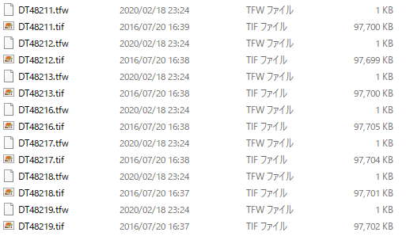

### QGISで開く

ペアのファイルをQGIS(3.18)で開く

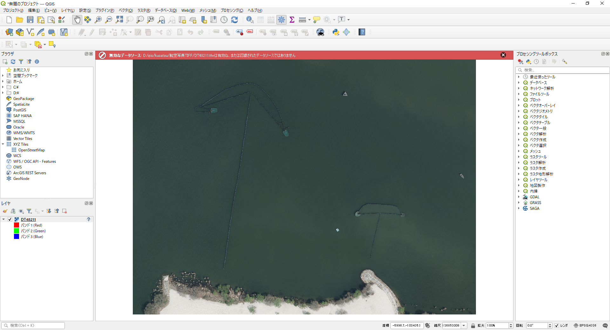

### 図法を指定する

`レイヤ`を右クリックして`レイヤCRS`から`レイヤのCRSを設定`から設定画面を開きます。
今回のワールドファイルの単位はJDS2011 平面直角座標系6系なので**EPSG:6674**を指定します

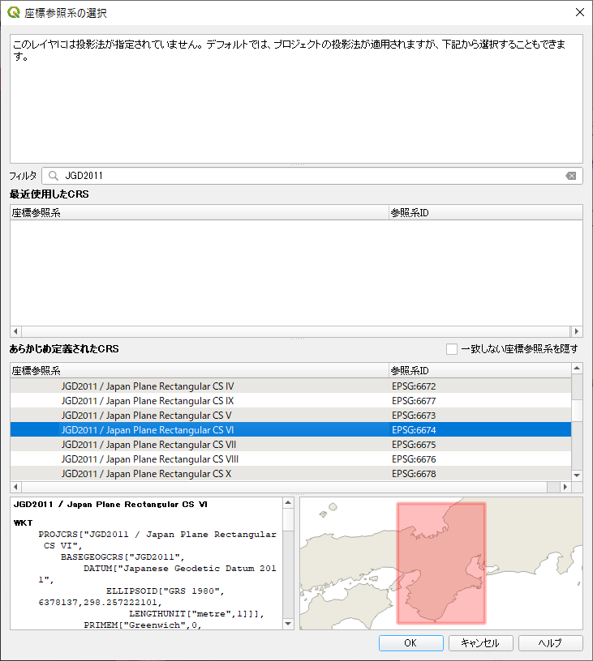

それぞれのレイヤに対して実行する

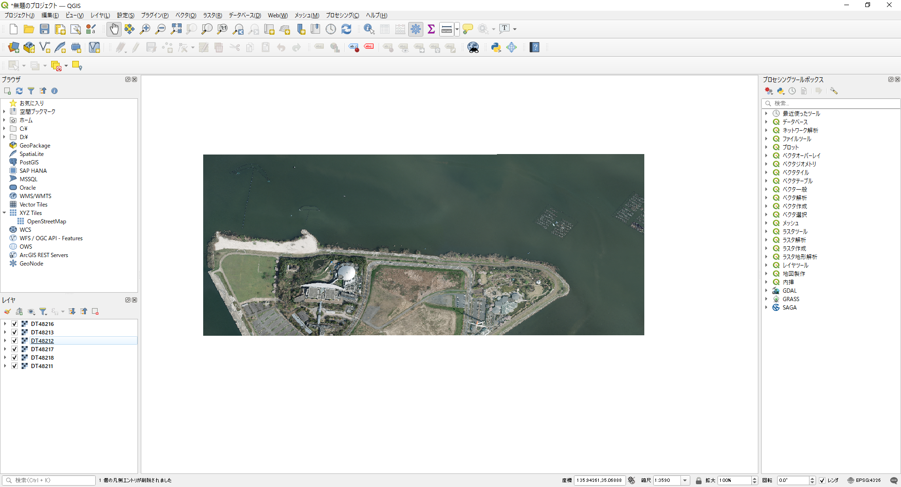

### レイヤを結合する

各レイヤを結合して1枚のラスター画像に変換する

上部のメニューから`ラスター` -> `その他` -> `結合` を選択する
入力レイヤから現在のレイヤをすべて選択する

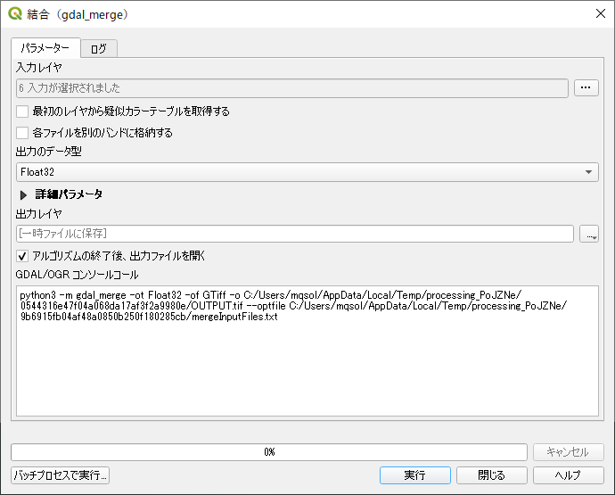
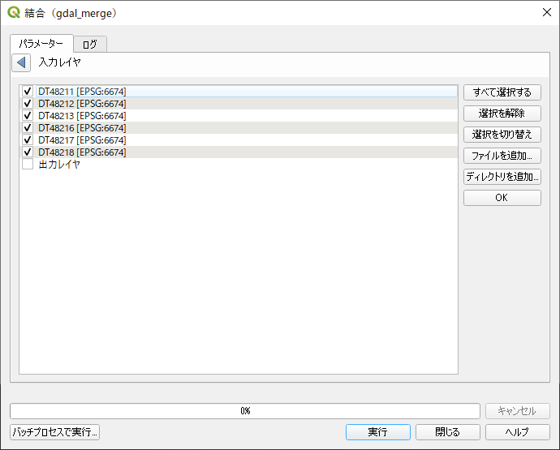

出力レイヤは一時ファイルにしているが、安全のためにファイルを指定してもかまわない。

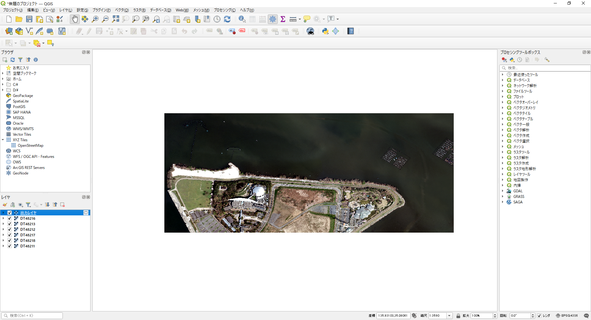

### 出力レイヤを緯度経度座標系に変換してエクスポートする

出力レイヤを右クリックして`エクスポート` -> `名前を付けて保存` をクリックする
座標参照系は**EPSG:4326**にする

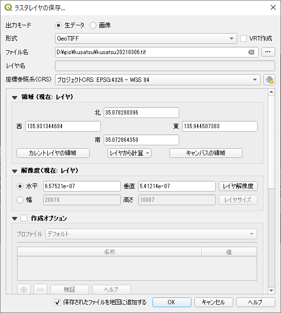

### タイルを作成する

#### プラグイン`QMetaTiles`をインストール

QMetaTilesがインストールされていな場合は事前にプラグインをインストールする
検索窓から*QMeta*を入れて抽出し、チェックボックス付けて右下の`インストール`をクリックしてインストールする

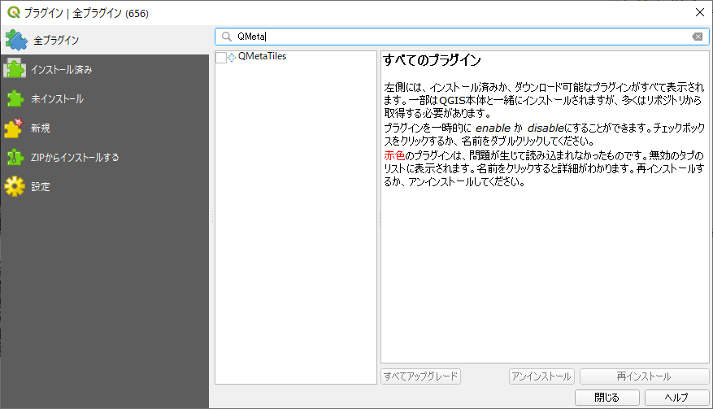

#### タイルの作成

上部メニューの`プラグイン` -> `QMetaTiles`を選択する

Outputは`Directory`からタイルを作成するディレクトリを選択する
`Tileset name` は 作成するディレクトリ名を入力する

Extentは`Layer extent`を選択しエクスポートしたレイヤを選択する

Zoomは最大12最小21にする

Metailingはチェックを外す外す

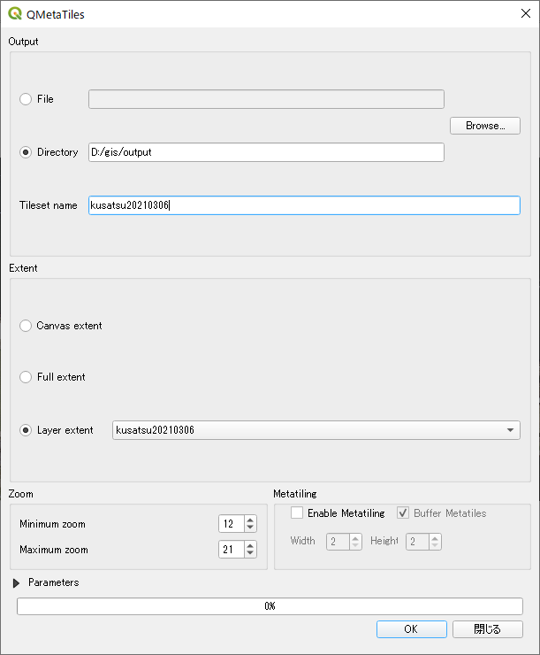

**※ 実行には時間がかかります**のでお待ちください


終了したら`閉じる`をクリックします。(OKを押して再実行しないように)

#### 作成結果

指定したフォルダに12から21のフォルダが作成されます

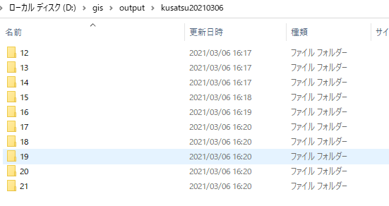

## サーバへのアップロード

出力された画像をサーバにアップロードし、公開します。

公開されたURLはこのような形式になります

```text
http://example.com/***/***/{z}/{x}/{y}.png
```
